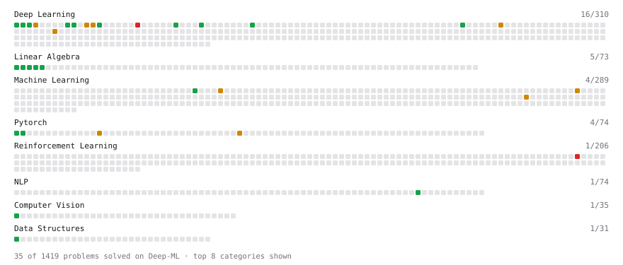

# Deep-ML

My machine learning practice from [Deep-ML](https://www.deep-ml.com). Every solution here was written by hand.

**29** solved · 29 problems · 0 labs · 0 math

[**Browse the interactive portfolio**](https://asuta274.github.io/deep-ml/) to replay this filling in over time.

## Problems

| | Difficulty | Solved | |
| --- | --- | --- | --- |
| [Build Attention Mask from Pad Tokens](https://www.deep-ml.com/problems/1064) | easy | 2026-09-09 | [solution](problems/1064-build-attention-mask-from-pad-tokens) |
| [Calculate Image Brightness](https://www.deep-ml.com/problems/70) | easy | 2026-09-11 | [solution](problems/0070-calculate-image-brightness) |
| [Calculate Mean by Row or Column](https://www.deep-ml.com/problems/4) | easy | 2026-09-06 | [solution](problems/0004-calculate-mean-by-row-or-column) |
| [Create a Float Tensor from a Python List](https://www.deep-ml.com/problems/880) | easy | 2026-09-10 | [solution](problems/0880-create-a-float-tensor-from-a-python-list) |
| [Generate a Confusion Matrix for Binary Classification](https://www.deep-ml.com/problems/75) | easy | 2026-09-16 | [solution](problems/0075-generate-a-confusion-matrix-for-binary-classification) |
| [Implement Global Average Pooling](https://www.deep-ml.com/problems/114) | easy | 2026-09-07 | [solution](problems/0114-implement-global-average-pooling) |
| [Implement ReLU Activation Function](https://www.deep-ml.com/problems/42) | easy | 2026-09-06 | [solution](problems/0042-implement-relu-activation-function) |
| [Implement the Swish Activation Function](https://www.deep-ml.com/problems/102) | easy | 2026-09-08 | [solution](problems/0102-implement-the-swish-activation-function) |
| [KL Divergence Between Two Normal Distributions](https://www.deep-ml.com/problems/56) | easy | 2026-09-07 | [solution](problems/0056-kl-divergence-between-two-normal-distributions) |
| [Leaky ReLU Activation Function](https://www.deep-ml.com/problems/44) | easy | 2026-09-06 | [solution](problems/0044-leaky-relu-activation-function) |
| [Matrix-Vector Dot Product](https://www.deep-ml.com/problems/1) | easy | 2026-09-05 | [solution](problems/0001-matrix-vector-dot-product) |
| [Min-Max Scaling of Feature Values](https://www.deep-ml.com/problems/112) | easy | 2026-09-07 | [solution](problems/0112-min-max-scaling-of-feature-values) |
| [Reshape Matrix](https://www.deep-ml.com/problems/3) | easy | 2026-09-06 | [solution](problems/0003-reshape-matrix) |
| [Scalar Multiplication of a Matrix](https://www.deep-ml.com/problems/5) | easy | 2026-09-06 | [solution](problems/0005-scalar-multiplication-of-a-matrix) |
| [Sigmoid Activation Function Understanding](https://www.deep-ml.com/problems/22) | easy | 2026-09-15 | [solution](problems/0022-sigmoid-activation-function-understanding) |
| [Single Neuron](https://www.deep-ml.com/problems/24) | easy | 2026-09-06 | [solution](problems/0024-single-neuron) |
| [Softmax Activation Function Implementation ](https://www.deep-ml.com/problems/23) | easy | 2026-09-06 | [solution](problems/0023-softmax-activation-function-implementation) |
| [Transpose of a Matrix](https://www.deep-ml.com/problems/2) | easy | 2026-09-05 | [solution](problems/0002-transpose-of-a-matrix) |
| [Your First Gradient with jax.grad](https://www.deep-ml.com/problems/1325) | easy | 2026-09-10 | [solution](problems/1325-your-first-gradient-with-jax-grad) |
| [Implement BatchNorm2d from Scratch (training mode)](https://www.deep-ml.com/problems/902) | medium | 2026-09-07 | [solution](problems/0902-implement-batchnorm2d-from-scratch-training-mode) |
| [Implement Gated Attention](https://www.deep-ml.com/problems/271) | medium | 2026-09-11 | [solution](problems/0271-implement-gated-attention) |
| [Implement Self-Attention Mechanism](https://www.deep-ml.com/problems/53) | medium | 2026-09-10 | [solution](problems/0053-implement-self-attention-mechanism) |
| [Implementing a Simple RNN](https://www.deep-ml.com/problems/54) | medium | 2026-09-07 | [solution](problems/0054-implementing-a-simple-rnn) |
| [KV Cache for Efficient Autoregressive Attention](https://www.deep-ml.com/problems/376) | medium | 2026-09-17 | [solution](problems/0376-kv-cache-for-efficient-autoregressive-attention) |
| [Linear Regression - Power Grid Optimization](https://www.deep-ml.com/problems/92) | medium | 2026-09-15 | [solution](problems/0092-linear-regression-power-grid-optimization) |
| [Numerical Gradient Checking](https://www.deep-ml.com/problems/313) | medium | 2026-09-16 | [solution](problems/0313-numerical-gradient-checking) |
| [Sigmoidal Accuracy-to-Log-Likelihood Scaling Law Fit](https://www.deep-ml.com/problems/790) | medium | 2026-09-09 | [solution](problems/0790-sigmoidal-accuracy-to-log-likelihood-scaling-law-fit) |
| [Single Neuron with Backpropagation](https://www.deep-ml.com/problems/25) | medium | 2026-09-07 | [solution](problems/0025-single-neuron-with-backpropagation) |
| [Off-Policy n-Step TD Prediction with Importance Sampling](https://www.deep-ml.com/problems/549) | hard | 2026-09-12 | [solution](problems/0549-off-policy-n-step-td-prediction-with-importance-sampling) |

---

_This file is regenerated by Deep-ML on every push._
